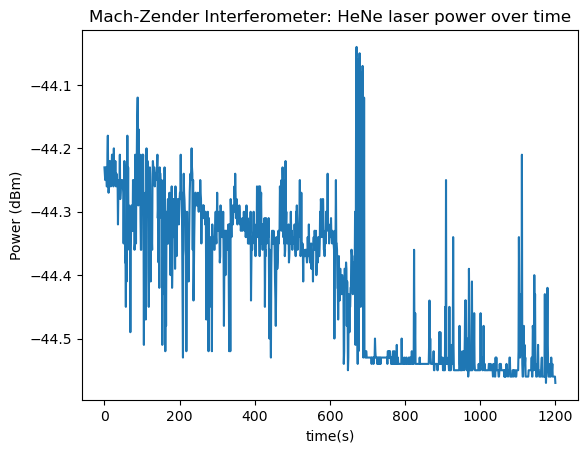

<h1> 
Mach-Zender Interferometer Experiment Report </h1>

Keisha Valenzuela and Javier Bates
 
valenzuela.keisha07@gmail.com

Introduction
</h1>

The purpose of this experiment was to utilise wave interference phenomena to identify possible impacts on an interference pattern using a Michelson interferometer with an adjustable beam length and a Helium Neon (HeNe) laser.

Interferometry is a measurement method of wave interference utilising the principle of superposition. This principle states that when two (or more) waves cross at a point, the displacement of the point is the sum of the two waves displacement (Bryan & Hellemans, 2004, p. 695). Interferometers work with electromagnetic waves to measure the inference pattern, when the waves are at peak construction or deconstruction. 

To construct the interferometer correctly, understanding about how light interacts with reflective surfaces such as mirrors are required. The law of reflection states the angle of incidence is equal to the angle of reflection. In simpler terms, the angle a ray of light hits a reflective surface is equal to the angle of the light that bounces away from the surface (Wood, 2024).

<small> *figure 1. Visual of the law of reflection*

<big>
Interferometers rely on the superposition principal and nature of light waves to produce interference fringes visualised as dark spaces in projected light. The experiment relies on the symmetry of all elements; If the two beams intensity are unequal, the conclusion you draw from changing variables would be unreliable due to the absence of a base measurement. In this experiment the ‘base measurement’ would be when the beams align at all peaks, showing equal fringes. This cannot happen if the beams are different intensities as the beams do not equally contribute to the peaks. 

In this experiment we explored the impact of beam length and horizontal shift on the interference pattern. 

After constructing the interferometer, the power measured of the final interference beam had major fluctuations between 0.3 and 0.7 micro watts. To determine the major contributing factors to the fluctuation a Fast Fourier Transform (FFT) was applied to the recorded data. 
### 
Materials and Methods

### 
materials

List of components used:
* Laser source
* Beam splitter
* Mirrors
* Adjustable translation stage
* Power meter
* Mounts, screws
### 
Setup construction

<small> *Figure 2. Mach-Zender Beam splitter diagram slightly modified from: (ChaosFlaws, 2016)*

<big> The first step was to tighten the bases of all elements to match the same height as the laser placing the optical elements before the laser and center the beam roughly in the center of the element.

The approximate location of the first mirror of arm one was identified. This position was marked and the translation stage was screwed into the table using the marked area as a guide. The first mirror was screwed into the right of the translation stage, and it was rotated slightly left. To track the beams movement a white card was held up and moved alongside the mirror. After reaching an approximate right angle the second mirror was placed in the beams path. This was a challenge due to the translation stage not being wide enough to accommodate both the mirrors’ bases. This was fixed by increasing the angle that the first mirror faced at to take up less horizontal space (*adjustments seen on figure 4*).

To ensure simplicity in construction, an initial position was chosen for the second beam-splitter. The third mirror of arm one was positioned along the same row as the second beam-splitter as symmetry is crucial to the success of the interferometer. To construct the second arm a mirror was fastened at the intersection of the two beam-splitters, no adjustments was done to the angle of the mirror at this time. 
 
 
 <Small> *Figure 3. Diagram of a Thorlabs mirror, denoting its adjusters.*
 <big>
 
 The horizontal shift knob was used to rotate the mirror, changing the angle of reflection as mentioned in the introduction to bounce into the beam-splitter.All the mirrors were adjusted until the output beam was a single dot seen *figure 4*. To be as accurate as possible, one arm was continuously blocked and unblocked to spot if there was any movement from one beam to the next.This process was repeated until there was no visual shift to the dot when each beam was blocked individually.

 <small> *figure 4. Visualised beam path of the laser*

### 
Challenges and adjustments

To confirm that the beam-splitter is 50%-50%, the power meter was placed the indicated point on each arm (figure 1. Red power meters) and it was determined that they had a percentage difference of 0.1% (Appendix 1) favoring arm two. This difference has an adverse effect on the interference pattern of the two beams as mentioned in the introduction. To combat this limitation two 0.1 ND filters were fastened intercepting arm two, reducing the beam path's intensity to 0.331 microwatts, a 0.004 difference to arm ones 0.327 microwatts, Decreasing the percentage difference to 0.001% (Appendix 1). This was decided to be reasonable enough to conduct the experiment. 

When adjusting the mirrors to form a single output, it was found that, though visually one dot, the fringes did not cover the entire dot. This indicated that the vertical alignment of the beams was off. To fix this problem the vertical shift knobs seen in *figure 3* were carefully adjusted until the mirror was perpendicular to the table.

### 
Results and Observations

To understand how the length of the beam affects the output of an interferometer, the power meter was positioned at the output and collected and tabled data for twenty minuets. As the sample rate of the meter was every second the table had 1200 rows of data. This data set can be found at https://github.com/TheDirector42/HeNemzacsses (contact authors to acess the repo). 

<medium>*figure 5. Graph of beam magnitude over time*

<big> *figure 5* presents the trend of the beams power over 1200 seconds. It shows that the fluctiation of the beam magnitude is highest when moving between peaks and troughs, when at peak construction (600-700 seconds) the beams power is visually the most stable. 

### 
Sources of interferance

Sources of Fluctuation

o	Environmental vibrations
o	Thermal effects
o	Imperfect alignment

# References
Bryan, B., & Hellemans, A. (2004). The history of science and technology. New York: Scientific Publishing Inc.

ChaosFlaws. (2016). Outcome of Mach-Zehnder interferometer experiment. Retrieved from https://physics.stackexchange.com/questions/274379/outcome-of-mach-zehnder-interferometer-experiment

CUEMATH. (2023). Percent Difference. Retrieved from https://www.cuemath.com/commercial-math/percent-difference/

Wood, D. (2024). Reflection: Angle of Incidence, Curved Surfaces & Diffusion. Retrieved from https://study.com/academy/lesson/reflection-angle-of-incidence-curved-surfaces-diffusion.html#:~:text=The%20law%20of%20reflection%20says,surface%20(angle%20of%20reflection)
# Appendices
### 
Appendix 1
 
(CUEMATH, 2023)

<ins>% difference= $\frac{difference}{Average}\times100$ </ins>

### Without ND filters
Difference without ND filters
= $0.373-0.327= 0.046$

Average without ND filters 
= $\frac{(0.373 + 0.327)}{2}\times100 = \frac{0.7}{2}\,100 = 35$

% Diff without ND filters = $\frac{0.046}{35}\times100=$**<ins> 0.1 </ins>** (1.s.f)

### With ND filters

Difference with ND filters = $0.331-0.327= 0.004$

Average with ND filters = $\frac{(0.331+0.327)}{2}\times100 = 0.329 \times 100 = 32.9$

% diff without ND filters= $\frac{0.004}{32.9}\times100$ = **<ins>0.0001</ins>** (1.s.f)
