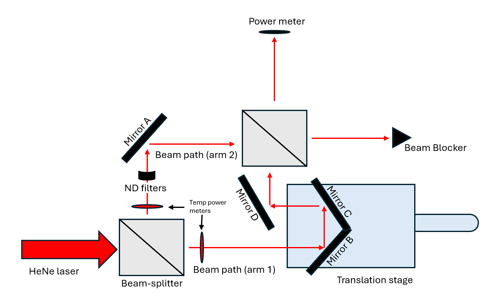
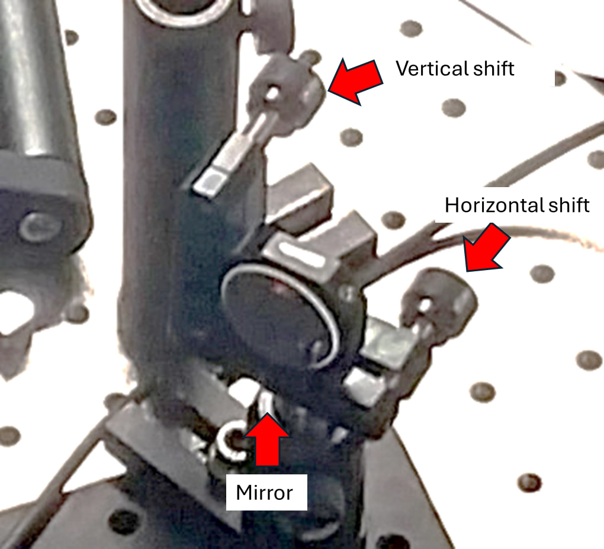
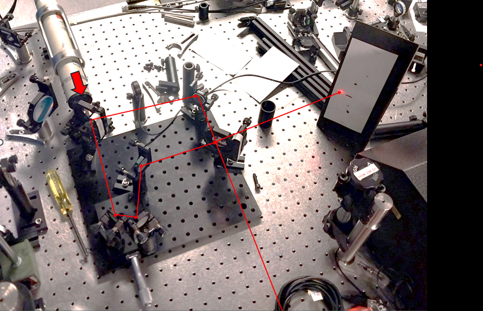
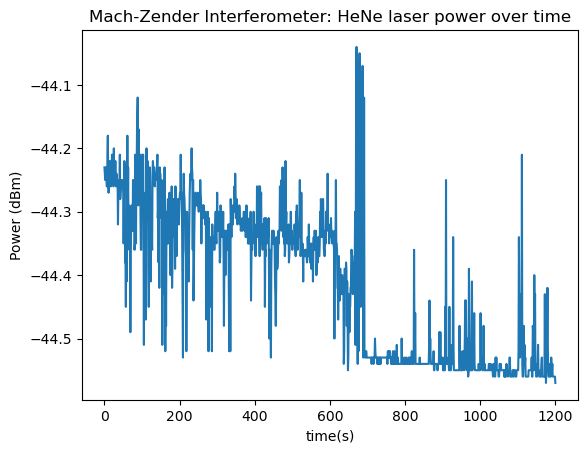
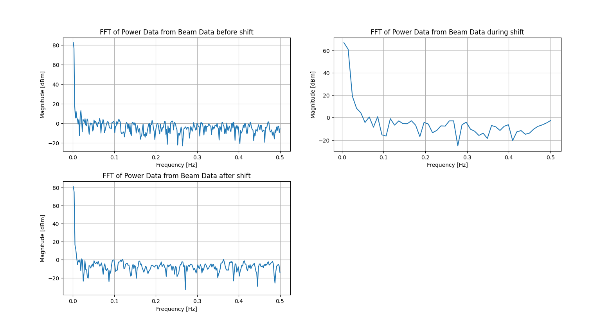
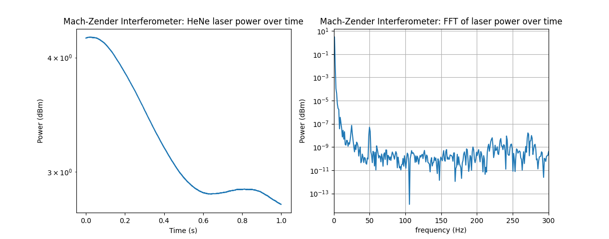

<h1> 
Mach-Zender Interferometer Experiment Report </h1>

Keisha Valenzuela and Javier Bates

valenzuela.keisha07@gmail.com

Introduction
</h1>

The purpose of this experiment was to investiage how varying beam path length and horizontal alignment affect interference patterns produced by a Mach-Zender interfermoeter using a Helium-Neon (HeNe) laser.

Interferometry is a technique for measuring wave interference based on the principle of superposition. This principle states that when two or more waves overlap at a point, their resulting displacement is the sum of their individual displacements at that point (Bryan & Hellemans, 2004, p. 695). By using electromagnetic waves, interferometers generate and analyze interference patterns, which arise from constructive interference (where wave peaks align) and destructive interference (where peaks and troughs cancel each other out). These patterns are key to making precise measurements in optical experiments that ustlise this technique.

In order to construct and effective interferometer, one requires an understanding of one of the fundamental properiteis of light, specifically refraction. Refraction dictates how light interacts with reflective surfaces, such as mirrors. The law of reflection states that the angle of incidence (the angle at which a ray of light strikes a reflective surface) is equal to the angle of reflection (the angle at which it bounces off). This principle ensures the precise alignment of mirrors, which is crucial for producing clear and reliable interference patterns (Wood, 2024).

<small> _Figure 1. Visual of the law of reflection_</small>

Additionally, Interferometers rely on the superposition principal and nature of light waves to produce interference fringes visualised as dark spaces in projected light. The experiment relies on the symmetry of all elements; If the two beams intensity are unequal, the conclusion you draw from changing variables would be unreliable due to the absence of a base measurement. In this experiment the ‘base measurement’ would be when the beams align at all peaks, showing equal fringes. This cannot happen if the beams are different intensities as the beams do not equally contribute to the peaks.

In this experiment we explored the impact of beam length and horizontal shift on the interference pattern.

After constructing the interferometer, the power measured of the final interference beam had major fluctuations between 0.3 and 0.7 micro watts. To determine the major contributing factors to the fluctuation a Fast Fourier Transform (FFT) was applied to the recorded data.
###

 Materials and Methods

materials

* HeNe laser with mount
* Kinematic mirror mount, KM100 Thorlabs
* Precision Kinematic Mirror, Mount KS2 Thorlabs
* UV Fused Silica Broadband Plate Beamsplitters (Coating: 350 - 1100 nm) Thorlabs
* BB03-E03 - Ø7.0 mm Broadband Dielectric Mirror, 750 - 1100 nm Thorlabs
* PT1 - 1" Translation Stage with Standard Micrometer, 1/4"-20 Taps Thorlabs
* S120C - Standard Photodiode Power Sensor, Si, 400 - 1100 nm, 50 nW - 50 mW
* BC106N-VIS - CCD Camera Beam Profiler, Ø30 µm - 6.6 mm, 350 - 1100 nm Thorlabs
* DET110 - High Speed Si Photo Detector, 17.5MHz BW, 350 to 1100nm Thorlabs

###

Setup construction

<small>Figure 2. Mach-Zender Beam splitter diagram modified from: (ChaosFlaws, 2016) </small>

The first step was to tighten the bases of all elements to match the same height as the laser, placing the optical elements before the laser and centering the beam roughly in the center of each element.

The approximate location of mirror B was identified. The translation stage was screwed into the table, mirror B was screwed into the right of the translation stage, and it was rotated slightly left. To track the beams movement a white card was held up and moved alongside the mirror. After reaching an approximate right angle mirror C was placed in the beams path. This was a challenge due to the translation stage width being too small to accommodate both the mirrors’ bases. This was fixed by increasing mirror B's angle, ocuppying less horizontal space (adjustments seen on figure 4).

To ensure simplicity in construction, an initial position for the second beam-splitter was chosen. Mirror D was positioned in line to the second beam-splitter, this ensures symmetry. To construct arm two, mirror A was fastened at the intersection of the two beam-splitters, no adjustments was done to the angle of any mirror at this time. 

<Small>Figure 3. Diagram of a Thorlabs mirror, denoting its adjusters. </small>

The horizontal shift knob was used to rotate the mirror, changing the angle of reflection of the beam, mentioned in the introduction, into the beam-splitter. All the mirrors were adjusted until the output beam was a single dot seen figure 4. To be as accurate as possible, one arm was continuously blocked and unblocked to spot if there was any movement from one beam to the next. This process was repeated until there was no visual shift to the dot when each beam was blocked individually.

<small> figure 4. Visualised beam path of the laser</small>

### 

Challenges and adjustments

When adjusting the mirrors to form a single output, it was found that, though visually one dot, the fringes did not cover the entire dot. This indicated that the vertical alignment of the beams was off. To fix this problem the vertical shift knobs seen in figure 3 were adjusted until the mirror was perpendicular to the table.

### 

Results and Observations

<small> figure 5. Power of a Mach-Zender interferometer over time. </small>

The translation stage was shifted from aproximently 9.1cm to 9cm at 600 seconds, causing beam path one to be longer then beam path two. This resulted in the shifting of the interferance pattern from contructive to destructive, changing the power output. 

It can be seen that there is major fluctuations in the data. This was the first indication of outside interferance on the interferometer. To identify the source of the interferance a Fast Furiour Transform was applied to the data. 

### 

Sources of interferance

Sources of Fluctuation

o Environmental vibrations
o Thermal effects
o Imperfect alignment

# 
References

Bryan, B., & Hellemans, A. (2004). The history of science and technology. New York: Scientific Publishing Inc.

ChaosFlaws. (2016). Outcome of Mach-Zehnder interferometer experiment. Retrieved from https://physics.stackexchange.com/questions/274379/outcome-of-mach-zehnder-interferometer-experiment

CUEMATH. (2023). Percent Difference. Retrieved from https://www.cuemath.com/commercial-math/percent-difference/

Wood, D. (2024). Reflection: Angle of Incidence, Curved Surfaces & Diffusion. Retrieved from https://study.com/academy/lesson/reflection-angle-of-incidence-curved-surfaces-diffusion.html#:~:text=The%20law%20of%20reflection%20says,surface%20(angle%20of%20reflection)

# 
Appendices

### 

Appendix 1
 
(CUEMATH, 2023)

<ins>% difference= <code data-type="math-inline" style="display:none">\frac{difference}{Average}\times100Averagedifference×100 </ins>

### 
Without ND filters

Difference without ND filters
= <code data-type="math-inline" style="display:none">0.373-0.327= 0.0460.373−0.327=0.046

Average without ND filters
= <code data-type="math-inline" style="display:none">\frac{(0.373 + 0.327)}{2}\times100 = \frac{0.7}{2}\,100 = 352(0.373+0.327)×100=20.7100=35

% Diff without ND filters = <code data-type="math-inline" style="display:none">\frac{0.046}{35}\times100=350.046×100=<strong data-marker="**"><ins> 0.1 </ins></strong> (1.s.f)

### 
With ND filters

Difference with ND filters = <code data-type="math-inline" style="display:none">0.331-0.327= 0.0040.331−0.327=0.004

Average with ND filters = <code data-type="math-inline" style="display:none">\frac{(0.331+0.327)}{2}\times100 = 0.329 \times 100 = 32.92(0.331+0.327)×100=0.329×100=32.9

% diff without ND filters= <code data-type="math-inline" style="display:none">\frac{0.004}{32.9}\times10032.90.004×100 = <strong data-marker="**"><ins>0.0001</ins></strong> (1.s.f)
